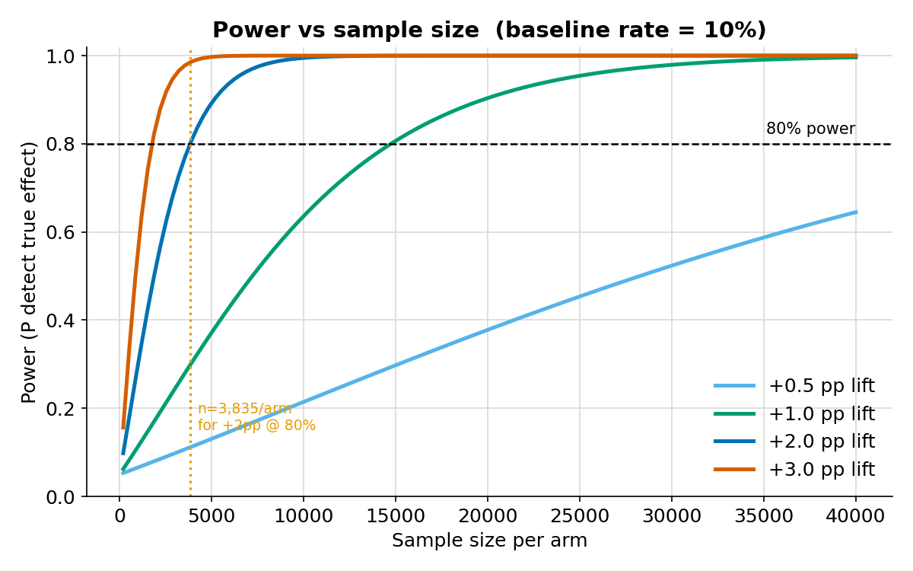
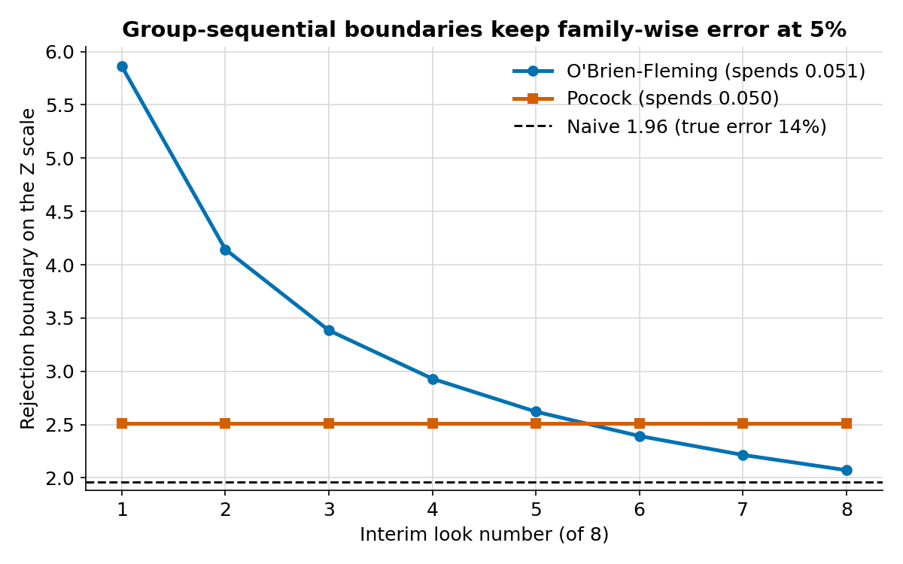
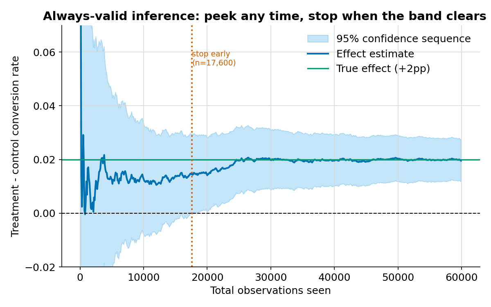

# A/B Testing Statistical Significance Platform

> A self-contained toolkit for designing, analysing and **early-stopping**
> online experiments — with sequential testing and power analysis, not just a
> single t-test.

[](https://github.com/t4rantul777/ab-testing-platform/actions)


[](https://abtest-platform777.streamlit.app/)

🇷🇺 **[Русская версия README →](README.ru.md)**

Most analyst A/B-testing projects stop at "run a t-test on two samples". This
one implements the parts that actually make experimentation trustworthy:
**confidence intervals, power analysis, and — the headline — valid sequential
testing** so you can peek at an experiment and stop it early without inflating
your false-positive rate. Everything runs locally on simulated data: **no API
keys, no database server, no cloud.**

---

## Why this project

If you run a fixed-horizon test but check the p-value every day and stop the
moment it dips below 0.05, your real false-positive rate is **not 5%** — with
five looks it is about **14%**, and it keeps climbing with every peek. This is
one of the most common and expensive mistakes in real experimentation. The
platform demonstrates the problem and implements three principled fixes.

```
Peeking 5x with a 1.96 cutoff  ->  real error 14.2% (not 5%!)
O'Brien-Fleming boundaries [4.56 3.23 2.63 2.28 2.04]  ->  spend exactly 0.050
Always-valid inference  ->  significant after 9,803 obs (80% fewer than 50,000)
```

## Features

| Area | What's implemented |
|------|--------------------|
| **Simulation** | Binary & continuous experiments with a known ground-truth effect; batch and interleaved-stream forms |
| **Significance** | Welch's t-test, two-proportion z-test, chi-square, all with confidence intervals and effect sizes (Cohen's d/h) |
| **Sequential** | Wald SPRT · always-valid confidence sequences (mixture SPRT) · Pocock & O'Brien-Fleming group-sequential boundaries |
| **Power & MDE** | Power, required sample size, minimum detectable effect, and power curves |
| **Persistence** | Every run logged to a local **SQLite** database (real SQL, incl. a window-function scoreboard query) |
| **App** | A 5-page **Streamlit** dashboard with an in-app **English / Russian** language switcher |
| **Quality** | **42 tests** — statistical correctness vs. references, error-rate control, and Streamlit page smoke tests |

## Screenshots

Power vs sample size, with the sample size for 80% power marked:



Group-sequential boundaries that keep the family-wise error at 5% (vs. the naive
1.96 line that does not):



An **always-valid confidence sequence** tightening over a live stream — stop as
soon as the band clears zero:



## Tech stack

`Python` · `SciPy` · `statsmodels` · `NumPy` · `pandas` · `Streamlit` ·
`Plotly` · `SQLite` · `pytest`

## Quick start

```bash
git clone https://github.com/t4rantul777/ab-testing-platform.git
cd ab-testing-platform
pip install -e ".[dev]"     # or: pip install -r requirements.txt

pytest                      # run the 42 tests
python examples/quickstart.py
streamlit run app/streamlit_app.py
```

`examples/quickstart.py` tours the whole API in ~40 lines:

```python
from abtest import (
    sample_size_proportions, simulate_experiment, analyze,
    group_sequential_boundaries, always_valid_from_stream, ExperimentConfig, MetricType,
)

n = sample_size_proportions(p1=0.10, mde_absolute=0.02, alpha=0.05, power=0.80)
cfg = ExperimentConfig(baseline=0.10, absolute_effect=0.02,
                       n_control=int(n), n_treatment=int(n), seed=7)
exp = simulate_experiment(cfg)
print(analyze(exp.control, exp.treatment, MetricType.BINARY).summary())
```

## Project structure

```
ab-testing-platform/
├── src/abtest/              # the library (import abtest)
│   ├── datamodel.py         # ExperimentConfig, TestResult, enums
│   ├── simulation.py        # batch + streaming data generation
│   ├── frequentist.py       # t-test, z-test, chi-square, effect sizes
│   ├── power.py             # power / sample size / MDE / curves
│   ├── sequential.py        # SPRT, mSPRT, Pocock/OBF boundaries
│   └── storage.py           # SQLite persistence layer
├── app/                     # Streamlit multipage dashboard
│   ├── streamlit_app.py     # home
│   └── pages/               # Simulator · Significance · Sequential · Power · History
├── tests/                   # 42 pytest tests (stats + app smoke)
├── scripts/make_figures.py  # regenerates the README figures
├── examples/quickstart.py   # end-to-end API tour
└── docs/methodology.md      # the maths behind every module
```

## How correctness is verified

This is not "trust me, the numbers look right". The suite checks each method
against an **independent reference or an exact identity**:

- `χ² == z²` for the 2×2 table (no continuity correction).
- The two-proportion z-test matches `statsmodels.proportions_ztest`.
- Power round-trips: computing the sample size for 80% power and asking for the
  power back returns 80%; simulating at that size gives ~80% empirical
  rejections.
- Group-sequential boundaries reproduce **published Pocock and O'Brien-Fleming
  values** and spend exactly the target α (checked by an independent recursion).
- Under H0 the false-positive rates of both the fixed and always-valid tests
  stay controlled across hundreds of simulations.

See [`docs/methodology.md`](docs/methodology.md) for the formulas.

## License

MIT — see [LICENSE](LICENSE).
